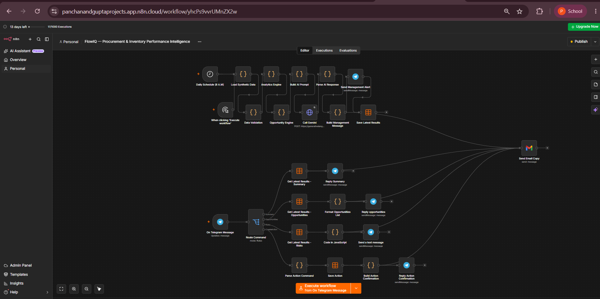
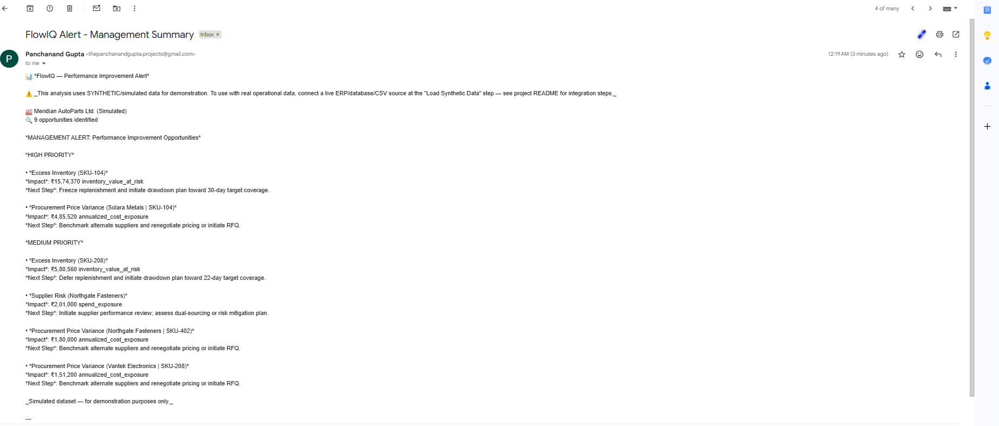
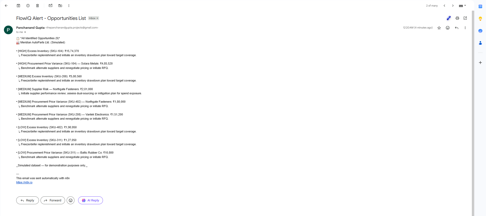
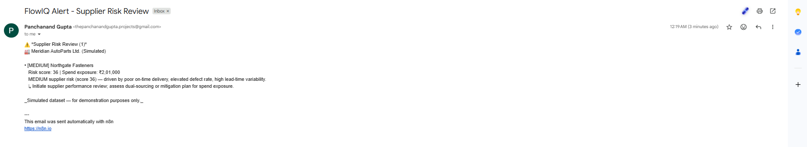

````markdown
# Procurement & Supply Chain Performance Intelligence

AI-powered performance improvement system built with n8n to identify procurement, inventory, and supplier opportunities, quantify financial exposure, and translate operational findings into actionable management decisions.

## Business Problem

Procurement and supply chain teams generate large amounts of operational data, but identifying improvement opportunities, quantifying their financial impact, and prioritizing actions can require significant manual analysis.

This project demonstrates a data-driven approach to connecting operational performance with financial impact and management action.

## What It Does

- Analyzes procurement price variance and annualized cost exposure
- Identifies excess inventory and working capital tied up in inventory
- Evaluates supplier performance and operational risk
- Quantifies improvement opportunities using deterministic analytics
- Prioritizes opportunities based on financial exposure and operational significance
- Uses Claude AI to interpret validated analytical findings and generate management recommendations
- Delivers automated management alerts and supports action tracking through Telegram

## Solution Flow

```text
Operational Data
       ↓
Data Validation
       ↓
Analytics Engine
       ↓
Opportunity Engine
       ↓
AI Interpretation
       ↓
Management Recommendations
       ↓
Alerts & Actions
````

## Key Analytics

### Procurement

* Price variance by supplier and SKU
* Annualized cost exposure
* Procurement cost-reduction opportunities

### Inventory

* Inventory days vs. target inventory days
* Excess inventory quantity
* Excess inventory value
* Working-capital exposure

### Supplier Performance

* On-time delivery
* Defect rate
* Lead-time variability
* Supplier risk scoring
* Spend exposure

## Key Output

The system converts operational data into a prioritized opportunity list containing:

* Identified improvement opportunity
* Supporting operational evidence
* Quantified financial exposure
* Priority level
* Recommended next step

Example opportunities include excess inventory, procurement price variance, and supplier performance risks.

Financial exposure represents identified improvement opportunity or risk exposure, not realized savings.

## AI Role

AI is used as an interpretation layer rather than the calculation engine.

Deterministic analytics calculate the underlying operational metrics and financial exposure. Claude AI receives these structured analytical results and converts them into concise management recommendations.

This separation keeps the core calculations traceable and reduces the risk of AI-generated analytical inaccuracies.

## Technology

* n8n
* JavaScript
* Claude API
* Telegram Bot API

## Data

The demonstration uses a simulated automotive-component manufacturer with synthetic procurement, inventory, and supplier data.

No real company, supplier, customer, or financial data is used.

## Architecture

The system follows a performance-improvement pipeline connecting operational data to financial exposure and management action.



## Demo

The project demonstrates:

* Management performance summary
* Prioritized improvement opportunities
* Supplier risk review
* Management action creation
* Automated email and Telegram alerts

### Management Summary



### Prioritized Opportunities



### Supplier Risk Review



### Action Created


### Automated Management Alerts


## Project Structure

```text
├── README.md
├── .gitignore
├── docs/
│   └── architecture.png
└── screenshots/
    ├── action-created.png
    ├── flowiq-email-alerts.png
    ├── management-summary.png
    ├── opportunities.png
    └── supplier-risk.png
```

## Disclaimer

This is an academic demonstration using synthetic data.

Financial figures represent identified opportunities or exposure based on the simulated dataset and should not be interpreted as realized savings, investment advice, or actual company performance.

```
```
